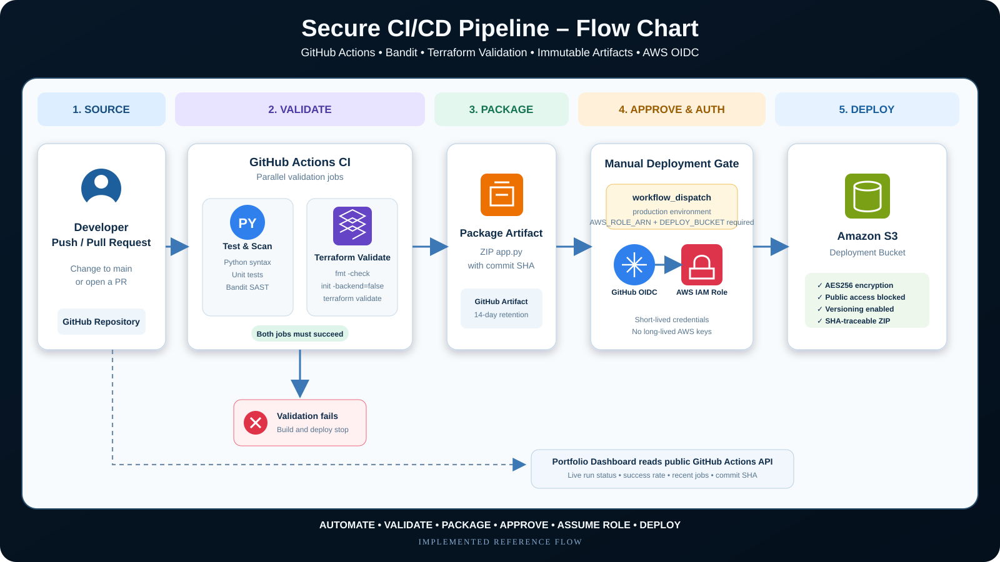
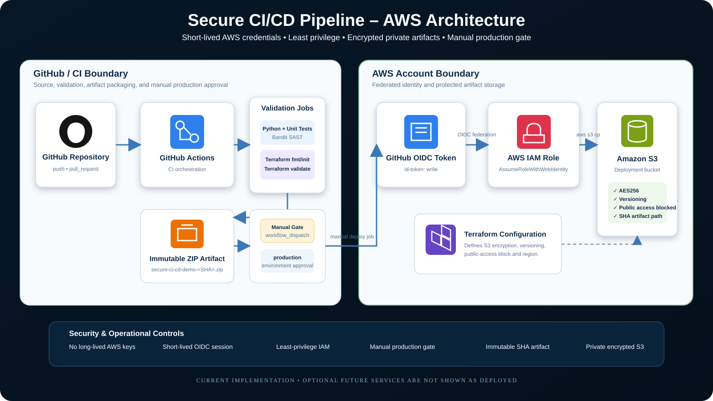

# Secure CI/CD Pipeline

A portfolio DevSecOps project that demonstrates a secure software delivery pipeline using GitHub Actions, Python tests, static security scanning, Terraform validation, immutable build artifacts, and optional AWS deployment with OpenID Connect (OIDC).

**Live dashboard:** https://dumm.cloud/projects/secure-ci-cd-pipeline/dashboard.html

The dashboard reads the latest public GitHub Actions workflow metadata and displays pipeline status, recent runs, success rate, average duration, commit information, stage status, and implemented security controls.

## Visual architecture

### CI/CD flow chart



### AWS architecture diagram



These diagrams reflect the current implementation: automated Python tests, Bandit scanning, Terraform validation, immutable ZIP artifacts, manual production deployment, GitHub OIDC authentication, a least-privilege AWS IAM role, and deployment to a private encrypted versioned S3 bucket.

## What this project demonstrates

- Automated CI on pull requests and pushes
- Python unit testing with the standard library
- Static security analysis with Bandit
- Terraform formatting and validation
- Build artifact packaging and retention
- Manual gated CD to AWS
- GitHub-to-AWS OIDC authentication instead of long-lived AWS access keys
- Least-privilege deployment policy examples
- Separation of build, security, infrastructure validation, and deployment stages
- Live web dashboard for pipeline telemetry

## Pipeline flow

```text
Developer Commit / Pull Request
          |
          v
      GitHub Actions
          |
          +--> Unit Tests
          |
          +--> Bandit Security Scan
          |
          +--> Terraform fmt + validate
          |
          v
     Package Artifact
          |
          v
   GitHub Build Artifact
          |
          v
Manual Production Approval / workflow_dispatch
          |
          v
 GitHub OIDC -> AWS IAM Role
          |
          v
   Encrypted S3 Deployment Bucket
```

## Repository contents

- `app.py` — dependency-free sample Python service with health/version endpoints
- `test_app.py` — unit tests
- `dashboard.html` — live GitHub Actions status and DevSecOps dashboard
- `terraform/main.tf` — secure encrypted S3 artifact bucket example
- `terraform/variables.tf` — Terraform input variables
- `docs/architecture.md` — design and security decisions
- `docs/iam-policy-deploy.json` — example least-privilege deployment policy
- `.github/workflows/secure-ci-cd-pipeline.yml` — CI/CD workflow

## Dashboard

The dashboard is a static portfolio page hosted with the site. It calls GitHub's public Actions API in the browser to show:

- Latest workflow conclusion and trigger
- Success rate across recent completed runs
- Average workflow duration
- Latest commit SHA and title
- Status of test/security scan, Terraform validation, packaging, and manual deployment stages
- Five most recent workflow runs with links back to GitHub Actions
- Security control summary for OIDC, Bandit, Terraform validation, gated deployment, and immutable artifacts

If the GitHub API is temporarily rate-limited, the dashboard fails safely and provides a direct link to GitHub Actions.

## CI stages

The workflow runs automatically on pushes and pull requests. It performs:

1. Source checkout
2. Python syntax validation
3. Unit tests
4. Bandit static security scan
5. Terraform formatting check
6. Terraform initialization without a backend
7. Terraform validation
8. Artifact packaging
9. Artifact upload to GitHub Actions

## CD stage

Deployment is intentionally gated behind a manual `workflow_dispatch` run and requires repository variables:

- `AWS_ROLE_ARN`
- `AWS_REGION`
- `DEPLOY_BUCKET`

The deployment job uses GitHub OIDC to request short-lived AWS credentials. No AWS access key or secret key is stored in the repository.

## Security controls

- No hardcoded credentials
- OIDC-based AWS authentication
- Short-lived AWS sessions
- Least-privilege S3 deployment permissions
- Encrypted S3 bucket configuration
- Public access blocked
- Automated tests and static analysis before packaging
- Deployment isolated from CI and triggered manually

## Portfolio note

This is a production-style reference implementation built to demonstrate secure CI/CD and DevSecOps engineering patterns. Cloud deployment requires the operator to configure their own AWS role, bucket, and GitHub repository variables.
